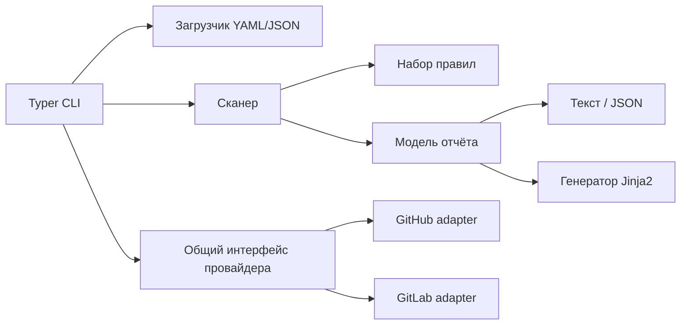

# Требования и проектирование Repo Doctor

Статус: предварительная версия до получения методических указаний.

## Функциональные требования

FR-01. Система принимает путь к репозиторию и рекурсивно анализирует его без изменения.

FR-02. Система проверяет README, LICENSE, `.gitignore`, манифест проекта и GitHub Actions
либо GitLab CI.

FR-03. Система обнаруживает `.env`, типовые текстовые признаки секретов и некорректные
локальные ссылки Markdown из `README.md`.

FR-04. Для каждого нарушения система выдаёт код правила, уровень, описание, путь,
рекомендацию и признак автоматического исправления.

FR-05. Система формирует текстовый или JSON-отчёт.

FR-06. Система показывает план исправлений в режиме `--dry-run` и создаёт недостающие
файлы только в режиме `--apply`.

FR-07. Система принимает YAML/JSON-конфигурацию, позволяет выключать правила и менять их
уровень. Неизвестные правила отклоняются.

FR-08. Через общий интерфейс система формирует запрос создания GitHub PR или GitLab MR.
Сетевой вызов разрешён только с `--apply`; dry-run не обращается к сети.

## Нефункциональные требования

NFR-01. Реализация и CI рассчитаны на Python 3.12.

NFR-02. По умолчанию операции read-only. Перезапись требует отдельного `--overwrite`.

NFR-03. Нормализация пути запрещает запись вне корня; символические ссылки не обходятся
при поиске и не используются как промежуточные каталоги генерации.

NFR-04. Бинарные файлы и файлы больше заданного лимита не декодируются как текст.

NFR-05. Значения токенов не выводятся; токены читаются только из переменных окружения.

NFR-06. Повторное исправление идемпотентно.

NFR-07. Ошибки конфигурации, пути, HTTP и сети имеют понятные сообщения и устойчивые коды.

NFR-08. Основные модули покрываются автоматическими тестами не менее чем на 80%.

## Варианты использования

UC-01 «Аудит»: пользователь выполняет `scan`, получает список нарушений, файлы не меняются.

UC-02 «Проверка в CI»: пользователь выполняет `check`; наличие ошибок даёт ненулевой код.

UC-03 «Предпросмотр»: пользователь выполняет `fix --dry-run` и видит план без записи.

UC-04 «Исправление»: пользователь подтверждает `fix --apply`; создаются только отсутствующие
файлы, повторный запуск ничего не меняет.

UC-05 «Конфигурация»: пользователь проверяет YAML/JSON через `config validate`.

UC-06 «Интеграция»: пользователь сначала выполняет `pr --dry-run`, отдельно публикует ветку,
задаёт токен через окружение и только затем явно разрешает API-вызов с `--apply`.

## Критерии приёмки

- AC-01: пустой репозиторий даёт пять нарушений обязательной структуры;
- AC-02: исправление пустого репозитория создаёт минимальный корректный набор;
- AC-03: второй запуск не меняет байты созданных файлов;
- AC-04: существующий README сохраняется;
- AC-05: повреждённая конфигурация и неизвестное правило отклоняются;
- AC-06: `.env` и типовая строка секрета обнаруживаются без раскрытия значения;
- AC-07: dry-run не меняет файловую систему и не вызывает API;
- AC-08: статусы HTTP 401, 403, 404, 409, 429 и 5xx превращаются в безопасные ошибки;
- AC-09: тайм-аут и сетевая ошибка обрабатываются;
- AC-10: CLI, unit/integration-тесты, Ruff, mypy, покрытие и сборка проходят.

## Модель конфигурации

Корневой объект содержит `version`, `scan`, `templates` и словарь `rules`. Pydantic
запрещает неизвестные поля. `scan.max_file_size` задаёт предел чтения; `scan.exclude` —
каталоги, исключённые из обхода; `templates` содержит только несекретные значения.

## Архитектура

Сканер и правила не зависят от CLI. Генератор получает уже сформированный отчёт. API-
адаптеры не участвуют в локальном исправлении и не выполняют Git-операций.

## Риски

| Риск | Вероятность/влияние | Мера управления |
|---|---|---|
| Ложное срабатывание поиска секретов | средняя/среднее | эвристика сообщает путь, не меняет файл |
| Запись вне корня | низкая/высокое | `resolve`, `relative_to`, запрет symlink-родителя |
| Потеря содержимого | низкая/высокое | отсутствие перезаписи по умолчанию, dry-run |
| Утечка токена | низкая/высокое | только env, нейтральные HTTP-ошибки |
| Изменение API провайдера | средняя/среднее | общий интерфейс, mock-тесты, ограниченный адаптер |
| Различия ОС | средняя/среднее | `pathlib`, CI-матрица, без shell-зависимого ядра |
| Неполная методичка | высокая/высокое | реквизиты и оформление помечены как предварительные |
